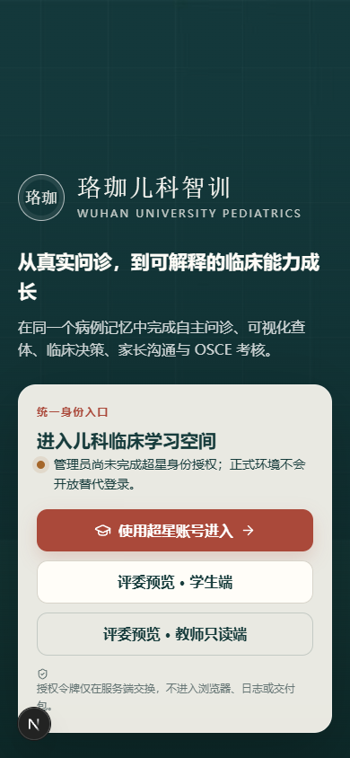
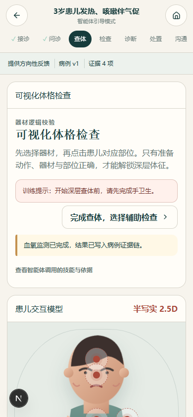
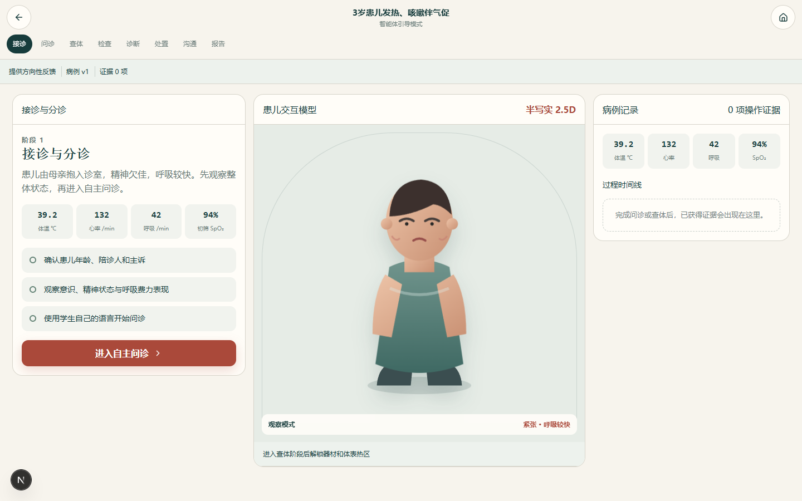
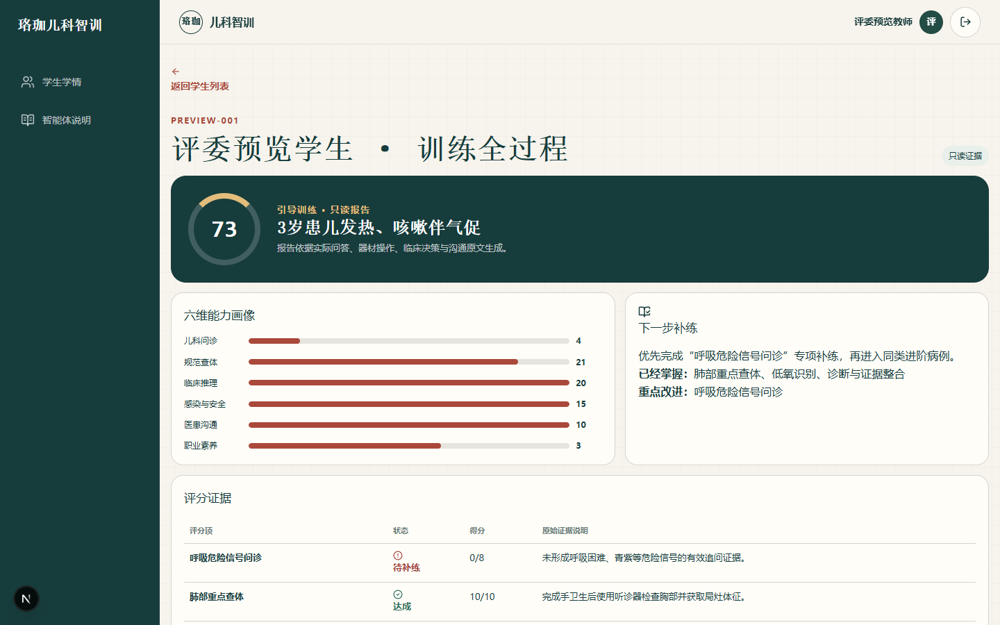
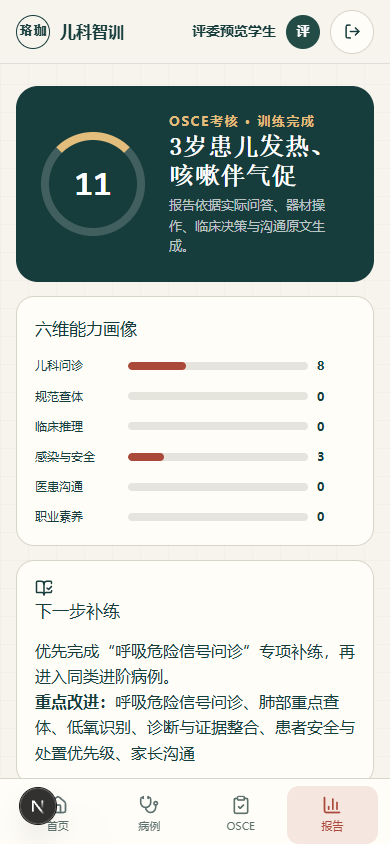

# 珞珈儿科智训本地验收报告

验收日期：2026-08-25

验收范围：本地全栈工程、统一智能体业务链、移动/桌面 UI、权限边界、生产构建与交付包。

外部边界：Coze 项目数据库、超星 OAuth 与超星表单尚无正式凭据，状态保持“待授权联调”。

## 1. 自动化结果

- TypeScript：通过。
- ESLint：通过。
- Node 测试：17/17 通过。
- Next.js 16.1.1 生产构建：通过；页面与 API 路由均完成构建。
- 自定义生产服务器：通过；默认生产模式下评委预览接口返回 404。
- 集成健康接口：应用正常；数据库、超星认证和表单同步均准确显示等待配置。

## 2. 浏览器全链路结果

- 已从评委预览登录完成一轮完整病例：问诊、医生干预、查体、辅助检查、诊断、处置、沟通与报告。
- 错误器材/部位组合以及未手卫生的深层查体均未泄露体征。
- OSCE 已实测倒计时、无教学提示、禁止回退和到时自动提交；自动生成 11 分证据报告。
- 教师只读端已实测学生筛选、报告、问答原文、器材/部位操作、诊疗提交及全过程时间线。
- 未登录直接进入 `/student` 会被稳定重定向至登录页，无偶发空用户 500。

## 3. 响应式与无障碍结果

| 视口宽度 | 页面横向溢出 | 工作区形态 |
| ---: | :---: | --- |
| 320px | 无 | 单任务 + 底部抽屉导航 |
| 390px | 无 | 单任务 + 底部抽屉导航 |
| 768px | 无 | 宽屏单任务 + 底部抽屉导航 |
| 1024px | 无 | 操作、患儿、记录三栏 |
| 1440px | 无 | 操作、患儿、记录三栏 |

- 移动端训练页全部可见按钮和链接触控区域不小于 44×44px。
- 键盘焦点样式、跳过导航、语义标签与 `aria-live` 已启用。
- `prefers-reduced-motion` 实测隐藏循环视频并停止动画。
- 登录背景 WebM（VP9）与 MP4（H.264）均为 1280×720、8 秒，并提供 SVG 静态海报。

## 4. 截图证据

### 移动端登录

### 移动端可视化查体

### 桌面端统一临床工作台

### 教师只读全过程

### OSCE 到时自动提交

## 5. 尚待真实联调

- 在 Coze 开发、生产环境分别执行数据库迁移并验证行级权限。
- 使用武汉大学正式 FID、超星学生账号和教师白名单账号完成 OAuth 登录。
- 取得超星表单写入地址、Token、表单 ID 与字段协议后，写入一条测试记录并人工核对。
