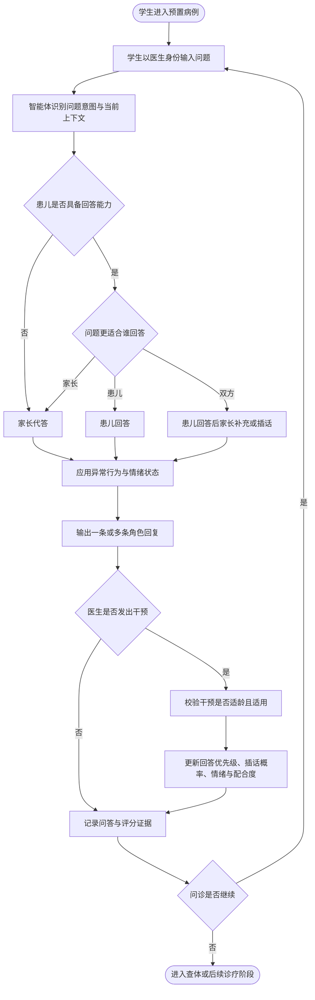

# 珞珈儿科智训｜功能需求重构讨论方案

## 一、重构结论

本次调整后，系统角色统一为以下三类：

1. **学生医生端**：学生以接诊医生身份完成问诊、干预、查体、判断、处置和沟通。
2. **教师学情端**：只读查看学生学习数据，不具备任务、病例、参数、评分或内容编辑权限。
3. **系统预置端**：由研发或系统运营人员在上线前完成病例、任务、模式、量表和参数配置，不向教师开放。

系统仍然是一个儿科临床教学智能体。患儿、家长不是两个供学生手动选择的固定机器人，而是同一病例对话中由智能体动态编排的两个信息提供者。

> 本方案中的“医生端”指学生扮演接诊医生时使用的临床操作端，不是带教教师实时介入端。

## 二、各端权限边界

| 功能 | 学生医生端 | 教师学情端 | 系统预置端 |
|---|---|---|---|
| 查看预置测试/训练 | 可用 | 仅能在学生报告中看到测试名称和版本 | 配置并发布 |
| 开始、继续和提交测试 | 可用 | 不可用 | 不可代替学生操作 |
| 问诊、查体、判断、处置、沟通 | 可用 | 不可用 | 配置规则和病例内容 |
| 发出对话干预或情绪安抚 | 可用 | 不可用 | 配置允许的干预类型 |
| 查看本人报告和答题记录 | 可用 | 不可修改 | 可用于故障排查 |
| 查询学生名单和个人报告 | 不可用 | 可用 | 可用 |
| 查看答题记录、操作记录和评分证据 | 仅本人 | 可用 | 可用 |
| 发布或分配任务 | 不可用 | **完全移除** | 上线前预置 |
| 修改任务参数、时间、模式或量表 | 不可用 | **完全移除** | 新版本上线前配置 |
| 修改病例、答案或评分 | 不可用 | **完全移除** | 按版本更新 |
| 评分复核、人工改分和评语写入 | 不可用 | **首版不提供** | 如未来需要须另行立项 |

### 教师端保留页面

- 学生列表：姓名/学号、完成次数、最近测试、最近成绩。
- 学生个人学情页：历次测试、能力维度、薄弱项和趋势。
- 测试报告详情：总分、分项分、遗漏点、错误操作和改进建议。
- 答题记录详情：医生问题、实际回答者、患儿回答、家长补充或插话、医生干预、时间和评分证据。
- 操作过程回放：查体部位、器材使用、辅助检查、诊断、处置和沟通事件。

### 教师端必须删除

- 发布任务、复制任务、调整截止时间。
- 修改病例、测试模式、难度、提示和重试次数。
- 修改OSCE量表、分值和一票否决规则。
- 人工改分、发布评语、审核资源或发布版本。
- 与上述能力对应的按钮、菜单、路由及写接口。

教师接口只保留查询类 `GET` 请求；对教师身份发起的新增、修改和删除请求统一返回 `403`。

## 三、任务预置机制

所有任务在系统上线前完成配置，每个任务至少锁定：

- `task_id`、名称和适用年级。
- 病例版本、知识库版本和量表版本。
- 训练、专项或OSCE模式。
- 是否显示提示、是否允许重试、计时方式。
- 可用时间范围和学生可见范围。
- 异常答题行为配置及随机种子。

任务发布后形成不可变版本。需要调整时由系统预置端生成新版本，已开始或已完成的会话继续引用原版本，保证报告可复现。

学生进入系统后直接看到已经上线的测试或训练，不经过教师发布、分配和参数设置流程。

## 四、动态答题模型

### 4.1 取消固定答题角色

学生端删除“选择患儿回答/选择家长回答”控件；问诊接口删除 `target_role` 参数。

学生只负责像真实医生一样提出问题。智能体根据病例和会话状态决定本轮由谁回答，以及是否出现第二位回答者插话或补充。

单轮回复由原来的一个字符串改为有顺序的回复列表：

```json
{
  "turn_id": "turn_018",
  "replies": [
    {"speaker": "child", "order": 1, "content": "我肚子疼。"},
    {"speaker": "parent", "order": 2, "content": "他昨晚还吐了两次。", "type": "supplement"}
  ],
  "visible_state": {
    "child_emotion": "nervous",
    "cooperation": "partial"
  }
}
```

学生界面根据返回顺序显示“患儿”“家长”身份标签，但学生不能事先指定回答者。

### 4.2 年龄与答题方式

| 患儿阶段 | 默认答题方式 | 可出现的真实情况 |
|---|---|---|
| 婴幼儿及表达能力不足 | 家长为主要回答者 | 患儿通过哭闹、动作和简单词语表达；医生要求患儿独立回答时可能无效 |
| 学龄前儿童 | 家长主答、患儿短句补充 | 患儿可能答非所问、害怕或拒绝配合 |
| 小学阶段 | 患儿与家长共同回答 | 患儿先回答，家长补充；家长可能抢答、纠正或扩大描述 |
| 初中及以上 | 患儿为主要回答者 | 家长可补充既往史；涉及隐私时患儿可能因家长在场而隐瞒 |

年龄不是唯一条件。系统还需要读取表达能力、认知水平、病情状态、情绪、问题类型以及当前医患关系。

### 4.3 回答者选择逻辑

每次学生提交问题后，按以下顺序处理：

1. 识别问题意图，例如当前症状、出生史、喂养史、主观感受或隐私问题。
2. 判断患儿是否有能力回答该问题。
3. 判断该信息更可能由患儿、家长或双方掌握。
4. 读取医生刚刚发出的干预指令及其有效期。
5. 读取家长插话倾向、患儿配合度、情绪和信任度。
6. 生成本轮回答顺序：家长代答、患儿回答、患儿后家长补充或家长插话后患儿回答。
7. 应用异常答题状态。
8. 从病例事实白名单中生成回答，禁止凭空增加病史。
9. 更新情绪、配合度、已披露事实和对话证据。

## 五、异常答题行为

异常行为不是完全随机生成，而是由病例预置、问题触发条件和当前对话状态共同决定。

| 异常状态 | 主要触发条件 | 表现方式 | 医生可采取的处理 |
|---|---|---|---|
| 答非所问 | 问题过长、含多个问题、患儿理解能力有限 | 回答其中一部分或偏离主题 | 简化、拆分或换一种问法 |
| 隐藏核心信息 | 敏感问题、家长在场、信任度不足 | 否认、回避或只披露部分事实 | 请求患儿独立回答、解释保密和询问目的 |
| 冗余回答 | 家长焦虑、问题过于开放 | 输出较长内容，关键信息夹在无关叙述中 | 打断并聚焦、总结后确认 |
| 拒不配合 | 疼痛、紧张、重复追问或沟通方式生硬 | 沉默、拒绝或要求停止 | 安抚情绪、解释目的、暂缓后再问 |
| 低落或负面情绪 | 病例预置、沟通刺激、缺少共情 | 回答简短、悲观、低声或回避目光 | 使用安抚表达并确认感受 |
| 医学认知不足 | 患儿或家长不理解医学术语 | 使用生活化、模糊或错误描述 | 改用通俗语言并核实含义 |
| 家长插话 | 家长焦虑、控制倾向高或认为患儿说不清 | 抢答、补充、纠正或否定患儿 | 请家长暂缓，让患儿先完整表达 |

同一轮最多激活1—2种主要异常状态，避免所有异常同时出现导致场景失真。训练模式可在结束后解释异常触发原因，OSCE过程中不显示行为标签。

## 六、医生端干预能力

### 6.1 交互入口

医生端在问诊输入框附近提供三个辅助操作，同时支持直接输入同义自然语言：

- 请患儿本人回答。
- 请家长暂时不要插话。
- 安抚患儿情绪。

按钮不直接篡改回答结果，而是向智能体提交结构化干预事件。医生仍需发送合适的表达内容，系统评价其语气和适用性。

### 6.2 干预执行规则

| 干预类型 | 前置校验 | 对后续会话的影响 | 无效或不当情况 |
|---|---|---|---|
| 请患儿独立回答 | 患儿具备相应表达能力 | 提高患儿回答优先级，暂时抑制家长补充 | 对婴幼儿或意识/表达能力不足患儿使用时不会强制生效 |
| 请家长不要插话 | 当前存在家长抢答或患儿需要独立表达 | 降低随后若干轮的家长插话概率 | 表达生硬可能降低家长配合度 |
| 情绪安抚 | 患儿存在紧张、低落、害怕或拒绝 | 改善情绪、信任度和配合度 | 空泛敷衍或否定感受时不改善状态 |

干预默认影响后续1—3轮，具体持续时间由场景配置。若后续出现新的强触发因素，家长仍可再次插话或患儿再次紧张，避免“一次点击永久解决”。

### 6.3 情绪安抚评价

安抚不是单纯点击得分。系统评价实际发送内容是否包含：

- 识别并回应患儿感受。
- 使用符合年龄的通俗表达。
- 解释接下来要做什么。
- 给予适度选择权或安全感。
- 避免否定、责备、恐吓和虚假保证。

## 七、完整问诊交互流程



## 八、可落地功能模块

### 8.1 动态答题编排器

负责年龄能力判断、问题意图识别、回答者排序和多角色回复组装。

### 8.2 家长插话控制器

根据家长性格、焦虑度、问题类型和医生干预决定是否抢答、补充或保持沉默。

### 8.3 异常行为引擎

维护答非所问、隐瞒、冗余、拒绝、负面情绪和医学认知不足等状态及触发条件。

### 8.4 情绪与关系状态机

维护患儿情绪、家长情绪、信任度和配合度，并根据医生表达动态更新。

### 8.5 医生干预服务

接收自然语言或快捷操作，校验干预是否适用，更新后续对话策略并记录评价证据。

### 8.6 对话证据账本

记录问题、回答顺序、插话、隐瞒、医生干预、情绪变化、事实披露和评分条目。

### 8.7 教师只读学情中心

提供学生查询、报告查看、答题记录和过程回放，不包含任何写操作。

### 8.8 预置任务配置模块

由研发或系统运营人员使用，负责上线前配置和版本发布，与教师账号完全隔离。

## 九、核心数据结构调整

病例需增加以下内部字段：

- `child_age_months`：患儿月龄。
- `verbal_capability`：表达能力。
- `cognitive_level`：认知理解水平。
- `child_emotion`：患儿当前情绪。
- `parent_emotion`：家长当前情绪。
- `parent_intrusion_tendency`：家长插话倾向。
- `cooperation_level`：配合度。
- `rapport_score`：医患信任度。
- `fact_knowledge_map`：患儿、家长分别掌握的事实。
- `behavior_profile`：允许出现的异常行为及触发条件。
- `active_interventions`：当前有效的医生干预及剩余轮次。

旧字段 `active_role` 不再表示学生选择的固定答题角色，改为系统生成的 `speaker_sequence`。

## 十、接口调整

### 学生问诊

```http
POST /agent/sessions/{session_id}/messages
```

请求只提交问题和会话版本，不再提交 `target_role`：

```json
{
  "text": "你最近为什么不想上学？",
  "request_id": "req_018",
  "expected_version": 27
}
```

### 医生干预

```http
POST /agent/sessions/{session_id}/interventions
```

```json
{
  "type": "child_answer_independently",
  "text": "我想先听听你自己的感受，可以吗？",
  "request_id": "req_019",
  "expected_version": 28
}
```

干预类型首版包括：

- `child_answer_independently`
- `parent_pause_interruption`
- `emotional_support`

### 教师只读接口

```http
GET /teacher/students
GET /teacher/students/{student_id}/reports
GET /teacher/reports/{report_id}
GET /teacher/sessions/{session_id}/answers
GET /teacher/sessions/{session_id}/events
```

删除或禁止教师访问：

```http
POST /teacher/tasks
PATCH /teacher/tasks/{id}
POST /teacher/resources/{id}/review
POST /teacher/scores/{id}/review
DELETE /teacher/*
```

## 十一、评分与报告调整

新增可追溯评价项：

- 是否根据年龄和表达能力选择恰当的沟通方式。
- 是否能识别并处理家长抢答或过度插话。
- 是否为适龄患儿提供独立表达机会。
- 是否识别患儿紧张、低落或拒绝配合。
- 情绪安抚是否具体、尊重且符合年龄。
- 面对答非所问和冗余回答时是否能重新聚焦。
- 是否通过通俗表达核实非医学化描述的真实含义。
- 是否通过建立信任获得被隐瞒的关键信息。

报告必须展示“学生行为—场景状态变化—对应评分项”，不能只给泛化评价。

## 十二、验收标准

### 教师端

- 教师页面不存在任务发布、编辑、审核和改分入口。
- 教师账号直接访问写接口返回 `403`。
- 教师能按学生查看测试报告、答题记录、角色回复顺序和操作证据。
- 报告中的任务名称和版本只读展示。

### 动态答题

- 学生界面不存在固定回答角色选择器。
- 低龄无表达能力患儿可以由家长全程代答。
- 学龄患儿可以出现患儿回答、家长补充和家长插话。
- 同一轮可以按顺序显示多条不同角色回复。
- 未被询问或不满足披露条件的事实不会主动泄露。
- 六类异常答题状态均有可复现测试病例和解除路径。

### 医生干预

- 支持自然语言和快捷入口发起三类干预。
- 干预会影响后续回答者优先级、家长插话概率、情绪或配合度。
- 不适龄或不恰当干预不会强制生效，并进入评分证据。
- 安抚效果根据实际表达评价，而不是点击即得分。

### 可追溯性

- 每次问题、回复、插话、干预和状态变化均写入事件账本。
- 重放相同病例版本、任务版本和随机种子时，关键行为链可复现。
- OSCE报告可定位到具体对话轮次和评分条目。

## 十三、需要同步修改的旧方案内容

本需求确认后，现有方案中的以下内容必须统一更新，不能保留并行入口：

- 将“教师资源审核、版本发布、任务布置、评分复核”改为“教师只读学情查看”。
- 删除教师端 `task.publish`、`resource.review` 和 `score.review` 能力。
- 删除 `POST /teacher/tasks` 等教师写接口。
- 删除问诊请求中的 `target_role`。
- 将固定 `active_role` 改为动态 `speaker_sequence`。
- 更新教师端UI、学生问诊UI、总体功能流程图、接口文档、测试计划和比赛演示脚本。
