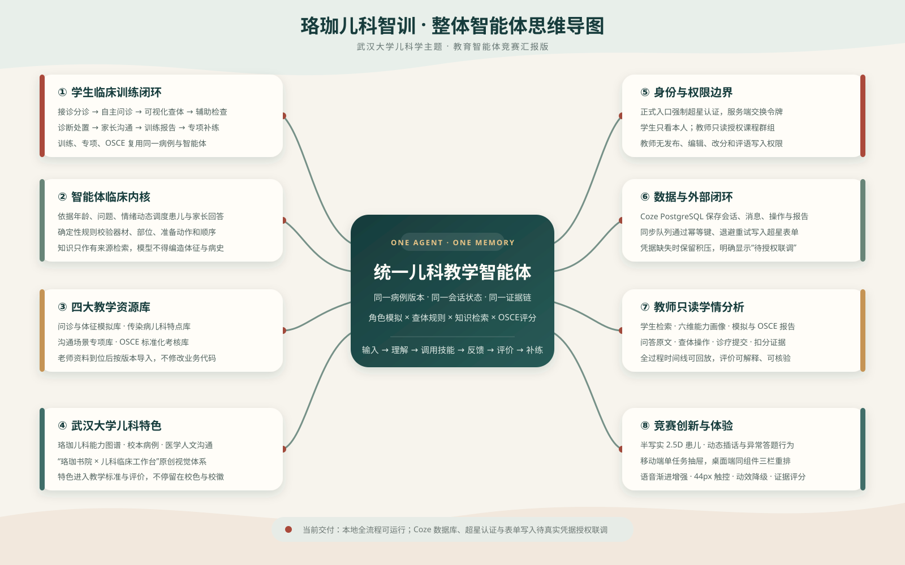
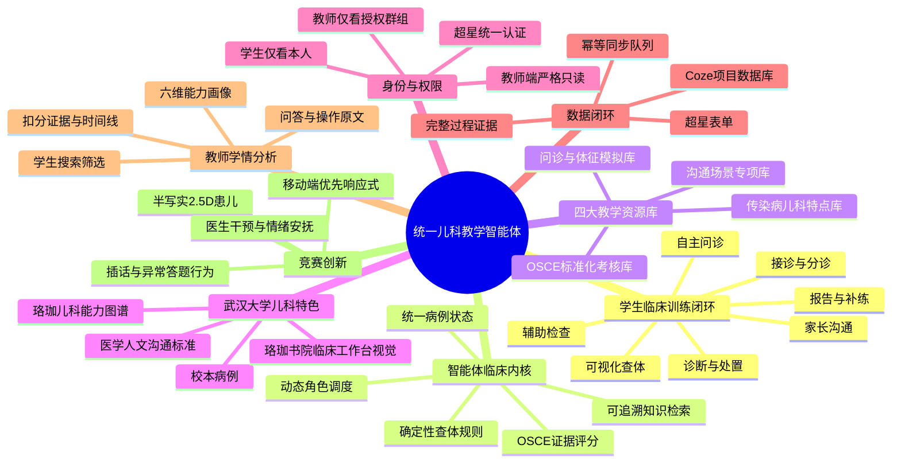

# 珞珈儿科智训整体智能体思维导图

## 汇报时的核心表述

珞珈儿科智训不是问诊、查体、OSCE 等功能的简单拼接，而是由一个统一儿科教学智能体贯穿完整临床训练。学生的每一次提问、查体操作、诊疗决策与沟通都会写入同一病例状态和证据链，最终形成可解释评分与补练建议；教师端只读取学情证据，不承担任务配置与内容编辑。

## 可编辑 Mermaid 源图

> 当前边界：本地全流程与预览身份已完成；Coze 数据库、超星认证和超星表单需在取得正式凭据后联调。
