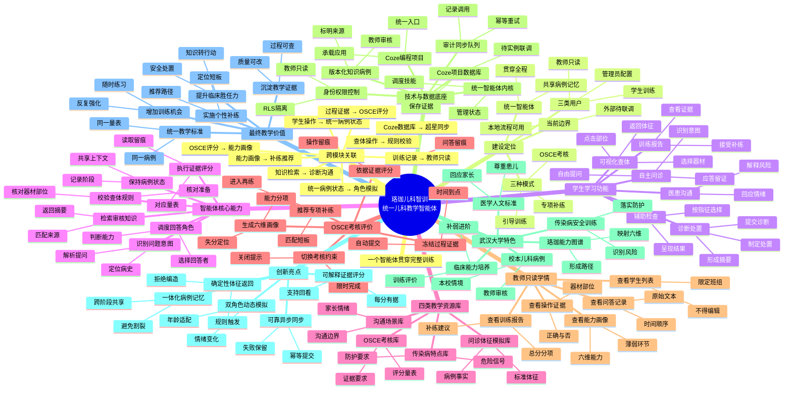

# 珞珈儿科智训｜智能体功能与完整运行流程交付说明

## 1. 《信息完整性检查结果》

服务对象、核心模块、输入输出、完整流程、14类关键判断、11类异常、教师只读权限、知识库与数据库分工、外部接口状态和最终教学产出均已明确。当前项目代码也能对应统一病例状态、角色调度、确定性查体规则、知识检索、证据评分、六维画像、只读教师端和异步同步队列。

结论：**无关键缺失，可以生成正式图表。**

## 2. 《待补充信息清单》

无关键缺失，可以生成正式图表。

不阻塞制图、但正式上线前仍需补齐：超星 APPID/APPKEY/FID、表单字段契约、Coze 数据库实例参数、校本病例与评分量表的教师审核版本。影响节点为身份认证、数据保存、超星同步和知识依据；建议由学校/平台授权后联调。默认方案为保留队列并显示“等待授权联调”。

## 3. 《默认假设说明》

1. “四类教学资源库”按既有“四库三引擎”口径：问诊体征模拟库、儿童传染病特点库、沟通场景库、OSCE考核库。
2. 训练模式包括引导训练、专项补练和 OSCE 考核，三者共用统一病例状态。
3. 责任主体与耗时是教师汇报级参考值，不代表外部平台服务等级承诺。
4. 教师仅查看授权班组的报告、问答、操作证据和能力画像，不编辑、发布、改分或写评语。
5. 医学内容、校本病例、指南版本和量表在正式使用前均须教师审核。

## 4. 《思维导图层级大纲》

中心：珞珈儿科智训｜统一儿科教学智能体——一个智能体贯穿完整儿科临床训练。

1. 建设定位
   - 统一智能体：贯穿全程、共享病例记忆
   - 三类用户：学生训练、教师只读、管理员配置
   - 三种模式：引导训练、专项补练、OSCE考核
   - 当前边界：本地流程可用、外部待联调
2. 学生学习功能
   - 自主问诊：自由提问、识别意图、应答留证
   - 可视化查体：选择器材、点击部位、返回体征
   - 辅助检查：按指征选择、呈现结果
   - 诊断处置：形成摘要、提交诊断、制定处置
   - 医患沟通：回应情绪、解释风险
   - 训练报告：查看证据、接受补练
3. 智能体核心能力
   - 识别问题意图：解析提问、定位病史
   - 调度回答角色：判断能力、选择回答者
   - 保持病例状态：记录阶段、共享上下文
   - 校验查体规则：核对准备、核对器材部位
   - 检索审核知识：匹配来源、返回摘要
   - 执行证据评分：读取留痕、对应量表
4. 四类教学资源库
   - 问诊体征模拟库：病例事实、标准体征
   - 传染病特点库：危险信号、防护要求
   - 沟通场景库：家长情绪、沟通边界
   - OSCE考核库：评分量表、证据要求
5. OSCE考核评价
   - 切换考核约束：限时完成、关闭提示
   - 冻结过程证据：时间到点、自动提交
   - 依据证据评分：问答留痕、操作留痕
   - 生成六维画像：能力分项、失分定位
   - 推荐专项补练：匹配短板、进入再练
6. 教师只读学情
   - 查看学生列表：限定班组、不得编辑
   - 查看训练报告：总分分项、补练建议
   - 查看问答记录：原始文本、时间顺序
   - 查看操作证据：器材部位、正确与否
   - 查看能力画像：六维能力、薄弱环节
7. 技术与数据底座
   - Coze编程项目：承载应用、统一入口
   - 统一智能体内核：调度技能、管理状态
   - Coze项目数据库：保存证据、待实例联调
   - 版本化知识病例：标明来源、教师审核
   - 身份权限控制：RLS隔离、教师只读
   - 审计同步队列：记录调用、幂等重试
8. 武汉大学特色
   - 珞珈能力图谱：映射六维、形成路径
   - 校本儿科病例：本校情境、教师审核
   - 医学人文标准：尊重患儿、回应家长
   - 传染病安全训练：识别风险、落实防护
   - 临床能力培养：训练评价、补弱进阶
9. 创新亮点
   - 一体化病例记忆：跨阶段共享、避免割裂
   - 双角色动态模拟：年龄适配、情绪变化
   - 确定性体征返回：规则触发、拒绝编造
   - 可解释证据评分：每分有据、支持回看
   - 可靠异步同步：幂等提交、失败保留
10. 最终教学价值
   - 增加训练机会：随时练习、反复强化
   - 统一教学标准：同一病例、同一量表
   - 提升临床胜任力：知识转行动、安全处置
   - 实施个性补练：定位短板、推荐路径
   - 沉淀教学证据：过程可查、质量可改

术语注释：角色调度＝决定由谁回答；状态机＝记录当前训练阶段；证据评分＝按真实记录评分；RLS＝按身份隔离数据；幂等同步＝重复提交不重复入库。

## 5. 《思维导图连接关系》

1. 学生操作 → 统一病例状态
2. 统一病例状态 → 角色模拟
3. 查体操作 → 规则校验
4. 知识检索 → 诊断沟通
5. 过程证据 → OSCE评分
6. OSCE评分 → 能力画像
7. 能力画像 → 补练推荐
8. 训练记录 → 教师只读
9. Coze数据库 → 超星同步

## 6. 《思维导图Mermaid源代码》

独立源文件：[珞珈儿科智训_智能体功能思维导图.mmd](./珞珈儿科智训_智能体功能思维导图.mmd)

## 7. 《思维导图SVG与PNG》

- [SVG矢量图](./珞珈儿科智训_智能体功能思维导图.svg)
- [4K PNG预览图](./珞珈儿科智训_智能体功能思维导图_4K.png)

## 8. 《完整流程节点清单》

| 编号 | 节点名称 | 责任主体 | 参考耗时 | 图形 |
| --- | --- | --- | --- | --- |
| S0 | 开始：学生发起登录 | 学生 | 即时 | start |
| P1 | 执行超星身份认证 | 超星平台 | 2—10秒 | process |
| D1 | 身份认证成功？ | 超星平台 | 即时 | decision |
| D2 | 属于允许机构？ | 超星平台 | 即时 | decision |
| D3 | 学生还是教师？ | 统一智能体 | 即时 | decision |
| P2 | 进入学生首页 | 学生 | 1—3秒 | process |
| P3 | 选择训练模式 | 学生 | 5—15秒 | process |
| P4 | 创建统一病例会话 | 统一智能体 | 1—3秒 | subprocess |
| P5 | 完成接诊与分诊 | 学生 | 30—60秒 | process |
| P6 | 输入问诊问题 | 学生 | 10—30秒 | process |
| P7 | 识别问题意图 | 统一智能体 | 1—3秒 | subprocess |
| D4 | 问题是否有效？ | 统一智能体 | 即时 | decision |
| D5 | 患儿能否回答？ | 角色模拟模块 | 即时 | decision |
| D6 | 家长需要插话？ | 角色模拟模块 | 即时 | decision |
| P8 | 调度患儿家长应答 | 角色模拟模块 | 1—3秒 | subprocess |
| D7 | 需要医生干预？ | 统一智能体 | 即时 | decision |
| P9 | 执行安抚秩序干预 | 学生 | 10—30秒 | process |
| D8 | 模型调用成功？ | 统一智能体 | 1—3秒 | decision |
| P10 | 执行可视化体检 | 学生 | 1—3分钟 | process |
| D9 | 器材部位匹配？ | 查体规则引擎 | 即时 | decision |
| D10 | 必要准备完成？ | 查体规则引擎 | 即时 | decision |
| P11 | 选择辅助检查 | 学生 | 30—60秒 | process |
| D11 | 存在危险信号？ | 统一智能体 | 即时 | decision |
| P12 | 优先执行安全处置 | 学生 | 30—60秒 | process |
| P13 | 提交摘要与诊断 | 学生 | 1—2分钟 | process |
| P14 | 检索儿科知识依据 | 知识检索模块 | 1—3秒 | subprocess |
| D12 | 存在可靠依据？ | 知识检索模块 | 即时 | decision |
| P15 | 提交治疗处置计划 | 学生 | 1—2分钟 | process |
| P16 | 完成患儿家长沟通 | 学生 | 1—2分钟 | process |
| D13 | 达到结束条件？ | 统一智能体 | 即时 | decision |
| D14 | OSCE时间结束？ | 统一智能体 | 即时 | decision |
| P17 | 冻结现有过程证据 | OSCE评分引擎 | 即时 | subprocess |
| D15 | 评分证据完整？ | OSCE评分引擎 | 即时 | decision |
| P18 | 执行评分训练评价 | OSCE评分引擎 | 3—10秒 | subprocess |
| P19 | 生成个人训练报告 | OSCE评分引擎 | 3—10秒 | document |
| D16 | 报告生成成功？ | OSCE评分引擎 | 即时 | decision |
| P20 | 生成六维能力画像 | OSCE评分引擎 | 1—3秒 | document |
| P21 | 生成专项补练建议 | 统一智能体 | 1—3秒 | document |
| DB1 | 保存Coze数据库 | Coze数据库 | 1—3秒 | database |
| P22 | 加入超星同步队列 | Coze数据库 | 即时 | database |
| D17 | 超星接口已配置？ | 超星平台 | 即时 | decision |
| P23 | 提交超星表单 | 超星平台 | 2—10秒 | process |
| D18 | 同步是否成功？ | 超星平台 | 即时 | decision |
| O1 | 学生个人训练报告 | 统一智能体 | 即时 | document |
| O2 | 学生获得补练路径 | 学生 | 即时 | document |
| O3 | 教师查看只读学情 | 教师 | 即时 | document |
| E0 | 形成儿科教学闭环 | 统一智能体 | 持续 | end |

## 9. 《正常流程连接关系》

| 来源 | 去向 | 条件 |
| --- | --- | --- |
| S0 | P1 | 正常 |
| P1 | D1 | 正常 |
| D1 | D2 | 是 |
| E1 | S0 | 重新授权 |
| D2 | D3 | 是 |
| D3 | P2 | 学生 |
| D3 | O3 | 教师 |
| P2 | P3 | 正常 |
| P3 | P4 | 正常 |
| P4 | P5 | 正常 |
| P5 | P6 | 正常 |
| P6 | P7 | 正常 |
| P7 | D4 | 正常 |
| D4 | D5 | 是 |
| E3 | P6 | 重新提问 |
| D5 | D6 | 是／否 |
| D6 | P8 | 是／否 |
| P8 | D7 | 正常 |
| D7 | P9 | 是 |
| D7 | D8 | 否 |
| P9 | D8 | 正常 |
| D8 | P10 | 是 |
| E4 | P10 | 预置事实 |
| P10 | D9 | 正常 |
| D9 | D10 | 是 |
| E5 | P10 | 重做 |
| D10 | P11 | 是 |
| E6 | P11 | 考核留痕 |
| E6 | P10 | 训练重做 |
| P11 | D11 | 正常 |
| D11 | P12 | 是 |
| D11 | P13 | 否 |
| P12 | P13 | 正常 |
| P13 | P14 | 正常 |
| P14 | D12 | 正常 |
| D12 | P15 | 是 |
| E7 | P15 | 无依据继续 |
| P15 | P16 | 正常 |
| P16 | D13 | 正常 |
| D13 | P6 | 否 |
| D13 | D14 | 是 |
| D14 | P17 | 是 |
| D14 | D15 | 否 |
| P17 | D15 | 正常 |
| D15 | P18 | 是 |
| D15 | P18 | 否：标记缺口 |
| P18 | P19 | 正常 |
| P19 | D16 | 正常 |
| D16 | P20 | 是 |
| E9 | DB1 | 保存证据 |
| P20 | P21 | 正常 |
| P21 | DB1 | 正常 |
| DB1 | P22 | 正常 |
| P22 | D17 | 正常 |
| D17 | P23 | 是 |
| E10 | O1 | 等待授权 |
| P23 | D18 | 正常 |
| D18 | O1 | 是 |
| E11 | O1 | 队列保留 |
| O1 | O2 | 正常 |
| O1 | O3 | 正常 |

## 10. 《异常流程连接关系》

| 来源 | 去向 | 条件或归宿 |
| --- | --- | --- |
| D1 | E1 | 否 |
| E1 | S0 | 重新授权 |
| D2 | E2 | 否 |
| D4 | E3 | 否 |
| E3 | P6 | 重新提问 |
| D8 | E4 | 否 |
| E4 | P10 | 预置事实 |
| D9 | E5 | 否 |
| E5 | P10 | 重做 |
| D10 | E6 | 否 |
| E6 | P11 | 考核留痕 |
| E6 | P10 | 训练重做 |
| D12 | E7 | 否 |
| E7 | P15 | 无依据继续 |
| D16 | E9 | 否 |
| E9 | DB1 | 保存证据 |
| D17 | E10 | 否 |
| E10 | O1 | 等待授权 |
| D18 | E11 | 否 |
| E11 | O1 | 队列保留 |
| O2 | E0 | 异常 |
| O3 | E0 | 异常 |

异常节点定义：

- E1 认证失败：返回登录并重新授权；归宿为“重新操作”。
- E2 机构角色不符：拒绝访问并联系管理员；归宿为“明确结束”。
- E3 问题无法识别：提示具体追问方向；归宿为“重新操作”。
- E4 模型调用失败：使用预置病例事实；归宿为“安全降级”。
- E5 器材部位错误：不返回深层体征并留痕；归宿为“重新操作”。
- E6 检查准备缺失：训练提示／考核扣分；归宿为“重新操作”。
- E7 知识依据不足：返回暂无经审核依据；归宿为“安全降级”。
- E8 OSCE时间结束：冻结证据并自动提交；归宿为“明确结束”。
- E9 报告生成异常：保留证据并标记待生成；归宿为“保存待处理”。
- E10 超星表单未配置：保留队列并等待授权；归宿为“保存待处理”。
- E11 超星同步失败：按幂等键最多重试8次；归宿为“保存待处理”。

## 11. 《完整流程图Mermaid源代码》

```mermaid
flowchart TB
  classDef startend fill:#173F35,color:#fff,stroke:#173F35,stroke-width:2px;
  classDef process fill:#FFFDF8,color:#243A35,stroke:#2F6654,stroke-width:2px;
  classDef decision fill:#FFF7E6,color:#243A35,stroke:#B8873D,stroke-width:2px;
  classDef document fill:#F0F3E8,color:#243A35,stroke:#667C4E,stroke-width:2px;
  classDef database fill:#E6F0EF,color:#243A35,stroke:#56797A,stroke-width:2px;
  classDef error fill:#FFF1EF,color:#7A201B,stroke:#B33A32,stroke-width:2px;
  PRE["前置条件<br/>病例任务已预置；超星账号可用；正式环境启用认证<br/>Coze数据库已配置；知识已版本化；教师仅只读<br/>超星认证与表单待授权联调"]
  S0(["开始：学生发起登录<br/><small>学生｜即时</small>"])
  P1["执行超星身份认证<br/><small>超星平台｜2—10秒</small>"]
  D1{"身份认证成功？<br/><small>超星平台｜即时</small>"}
  D2{"属于允许机构？<br/><small>超星平台｜即时</small>"}
  D3{"学生还是教师？<br/><small>统一智能体｜即时</small>"}
  P2["进入学生首页<br/><small>学生｜1—3秒</small>"]
  P3["选择训练模式<br/><small>学生｜5—15秒</small>"]
  P4[["创建统一病例会话<br/><small>统一智能体｜1—3秒</small>"]]
  P5["完成接诊与分诊<br/><small>学生｜30—60秒</small>"]
  P6["输入问诊问题<br/><small>学生｜10—30秒</small>"]
  P7[["识别问题意图<br/><small>统一智能体｜1—3秒</small>"]]
  D4{"问题是否有效？<br/><small>统一智能体｜即时</small>"}
  D5{"患儿能否回答？<br/><small>角色模拟模块｜即时</small>"}
  D6{"家长需要插话？<br/><small>角色模拟模块｜即时</small>"}
  P8[["调度患儿家长应答<br/><small>角色模拟模块｜1—3秒</small>"]]
  D7{"需要医生干预？<br/><small>统一智能体｜即时</small>"}
  P9["执行安抚秩序干预<br/><small>学生｜10—30秒</small>"]
  D8{"模型调用成功？<br/><small>统一智能体｜1—3秒</small>"}
  P10["执行可视化体检<br/><small>学生｜1—3分钟</small>"]
  D9{"器材部位匹配？<br/><small>查体规则引擎｜即时</small>"}
  D10{"必要准备完成？<br/><small>查体规则引擎｜即时</small>"}
  P11["选择辅助检查<br/><small>学生｜30—60秒</small>"]
  D11{"存在危险信号？<br/><small>统一智能体｜即时</small>"}
  P12["优先执行安全处置<br/><small>学生｜30—60秒</small>"]
  P13["提交摘要与诊断<br/><small>学生｜1—2分钟</small>"]
  P14[["检索儿科知识依据<br/><small>知识检索模块｜1—3秒</small>"]]
  D12{"存在可靠依据？<br/><small>知识检索模块｜即时</small>"}
  P15["提交治疗处置计划<br/><small>学生｜1—2分钟</small>"]
  P16["完成患儿家长沟通<br/><small>学生｜1—2分钟</small>"]
  D13{"达到结束条件？<br/><small>统一智能体｜即时</small>"}
  D14{"OSCE时间结束？<br/><small>统一智能体｜即时</small>"}
  P17[["冻结现有过程证据<br/><small>OSCE评分引擎｜即时</small>"]]
  D15{"评分证据完整？<br/><small>OSCE评分引擎｜即时</small>"}
  P18[["执行评分训练评价<br/><small>OSCE评分引擎｜3—10秒</small>"]]
  P19[/"生成个人训练报告<br/><small>OSCE评分引擎｜3—10秒</small>"/]
  D16{"报告生成成功？<br/><small>OSCE评分引擎｜即时</small>"}
  P20[/"生成六维能力画像<br/><small>OSCE评分引擎｜1—3秒</small>"/]
  P21[/"生成专项补练建议<br/><small>统一智能体｜1—3秒</small>"/]
  DB1[("保存Coze数据库<br/><small>Coze数据库｜1—3秒</small>")]
  P22[("加入超星同步队列<br/><small>Coze数据库｜即时</small>")]
  D17{"超星接口已配置？<br/><small>超星平台｜即时</small>"}
  P23["提交超星表单<br/><small>超星平台｜2—10秒</small>"]
  D18{"同步是否成功？<br/><small>超星平台｜即时</small>"}
  O1[/"学生个人训练报告<br/><small>统一智能体｜即时</small>"/]
  O2[/"学生获得补练路径<br/><small>学生｜即时</small>"/]
  O3[/"教师查看只读学情<br/><small>教师｜即时</small>"/]
  E0(["形成儿科教学闭环<br/><small>统一智能体｜持续</small>"])
  E1["认证失败<br/><small>返回登录并重新授权｜重新操作</small>"]
  E2["机构角色不符<br/><small>拒绝访问并联系管理员｜明确结束</small>"]
  E3["问题无法识别<br/><small>提示具体追问方向｜重新操作</small>"]
  E4["模型调用失败<br/><small>使用预置病例事实｜安全降级</small>"]
  E5["器材部位错误<br/><small>不返回深层体征并留痕｜重新操作</small>"]
  E6["检查准备缺失<br/><small>训练提示／考核扣分｜重新操作</small>"]
  E7["知识依据不足<br/><small>返回暂无经审核依据｜安全降级</small>"]
  E8["OSCE时间结束<br/><small>冻结证据并自动提交｜明确结束</small>"]
  E9["报告生成异常<br/><small>保留证据并标记待生成｜保存待处理</small>"]
  E10["超星表单未配置<br/><small>保留队列并等待授权｜保存待处理</small>"]
  E11["超星同步失败<br/><small>按幂等键最多重试8次｜保存待处理</small>"]
  PRE -.-> S0
  S0 --> P1
  P1 --> D1
  D1 -->|是| D2
  D1 -->|否| E1
  E1 -->|重新授权| S0
  D2 -->|是| D3
  D2 -->|否| E2
  D3 -->|学生| P2
  D3 -->|教师| O3
  P2 --> P3
  P3 --> P4
  P4 --> P5
  P5 --> P6
  P6 --> P7
  P7 --> D4
  D4 -->|是| D5
  D4 -->|否| E3
  E3 -->|重新提问| P6
  D5 -->|是／否| D6
  D6 -->|是／否| P8
  P8 --> D7
  D7 -->|是| P9
  D7 -->|否| D8
  P9 --> D8
  D8 -->|是| P10
  D8 -->|否| E4
  E4 -->|预置事实| P10
  P10 --> D9
  D9 -->|是| D10
  D9 -->|否| E5
  E5 -->|重做| P10
  D10 -->|是| P11
  D10 -->|否| E6
  E6 -->|考核留痕| P11
  E6 -->|训练重做| P10
  P11 --> D11
  D11 -->|是| P12
  D11 -->|否| P13
  P12 --> P13
  P13 --> P14
  P14 --> D12
  D12 -->|是| P15
  D12 -->|否| E7
  E7 -->|无依据继续| P15
  P15 --> P16
  P16 --> D13
  D13 -->|否| P6
  D13 -->|是| D14
  D14 -->|是| P17
  D14 -->|否| D15
  P17 --> D15
  D15 -->|是| P18
  D15 -->|否：标记缺口| P18
  P18 --> P19
  P19 --> D16
  D16 -->|是| P20
  D16 -->|否| E9
  E9 -->|保存证据| DB1
  P20 --> P21
  P21 --> DB1
  DB1 --> P22
  P22 --> D17
  D17 -->|是| P23
  D17 -->|否| E10
  E10 -->|等待授权| O1
  P23 --> D18
  D18 -->|是| O1
  D18 -->|否| E11
  E11 -->|队列保留| O1
  O1 --> O2
  O1 --> O3
  O2 --> E0
  O3 --> E0
  class S0,E0 startend;
  class D1,D2,D3,D4,D5,D6,D7,D8,D9,D10,D11,D12,D13,D14,D15,D16,D17,D18 decision;
  class P19,P20,P21,O1,O2,O3 document;
  class DB1,P22 database;
  class P1,P2,P3,P4,P5,P6,P7,P8,P9,P10,P11,P12,P13,P14,P15,P16,P17,P18,P23 process;
  class E1,E2,E3,E4,E5,E6,E7,E8,E9,E10,E11 error;
```

独立源文件：[珞珈儿科智训_智能体完整运行流程图.mmd](./珞珈儿科智训_智能体完整运行流程图.mmd)

## 12. 《流程图SVG与PNG》

- [SVG矢量图](./珞珈儿科智训_智能体完整运行流程图.svg)
- [A3高清 PNG预览图](./珞珈儿科智训_智能体完整运行流程图_A3.png)

SVG 导出：浏览器打开 SVG 后打印或另存；也可在 PowerPoint 中直接插入 SVG。Mermaid 导出：将 MMD 内容粘贴到 Mermaid Live Editor，选择 Actions → Export SVG；导出后检查微软雅黑/思源黑体替换和文字溢出。

## 13. 《三分钟教师汇报讲解顺序》

1. **0:00—0:25｜它是什么**：这是一个统一儿科教学智能体，不是页面集合。学生从问诊到报告始终面对同一病例记忆。
2. **0:25—1:05｜学生怎么用**：学生选择引导、专项或 OSCE 模式，完成问诊、查体、辅助检查、诊断处置和家长沟通。
3. **1:05—1:45｜为什么可信**：患儿与家长由角色模块调度；医学体征由器材、部位、准备和顺序规则确定；知识有来源；评分读取真实问答和操作证据。
4. **1:45—2:20｜如何形成闭环**：过程证据形成报告和六维画像，画像定位短板并推荐补练；教师只读查看真实学情。
5. **2:20—2:45｜武大特色与创新**：珞珈能力图谱、校本病例、儿科医学人文、传染病与患者安全贯穿同一病例；创新点是统一记忆、双角色动态模拟、确定性体征和可解释评分。
6. **2:45—3:00｜边界与落地**：本地完整流程可演示；Coze 数据库实例、超星认证与表单仍待授权联调，系统会保留同步队列，不冒充已打通。

## 14. 《全链路校验报告》

- 内容完整性：通过。覆盖统一智能体、学生、教师、外部平台、输入处理输出、正常与异常流程。
- 业务逻辑：通过。所有判断均有“是/否”去向；异常归入重新操作、安全降级、保存待处理或明确结束；教师权限未扩大；问题无效时不泄露隐藏病史；体征由规则返回；评分依据证据。
- 图形规范：通过。主图使用统一配色、标准箭头和图形；完整连接以 Mermaid 和关系清单双重保留；SVG 无文本溢出；PNG 达到 3840×2160 或 A3 4960×3508。
- 汇报理解：通过。主图优先呈现“一个智能体—完整训练—证据评价—补练闭环”，并标明武汉大学特色和待授权边界。

**全链路校验通过。**
