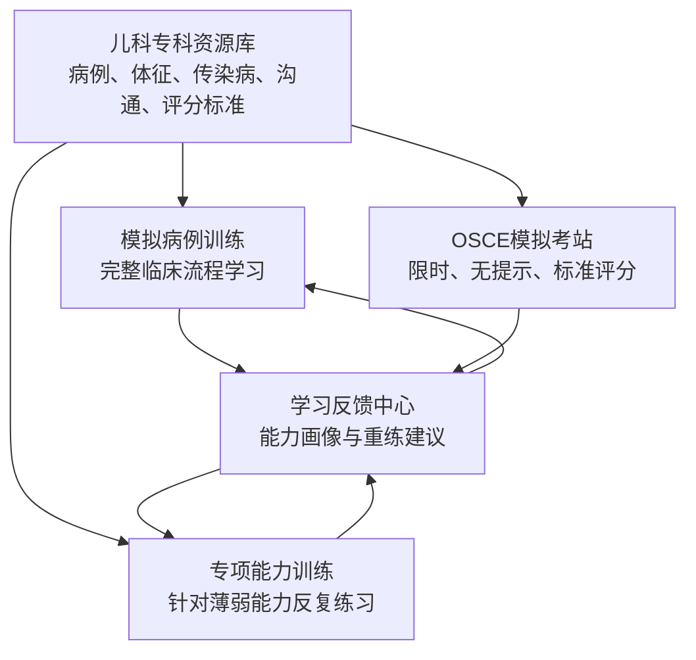
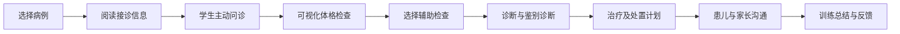
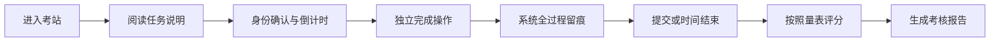
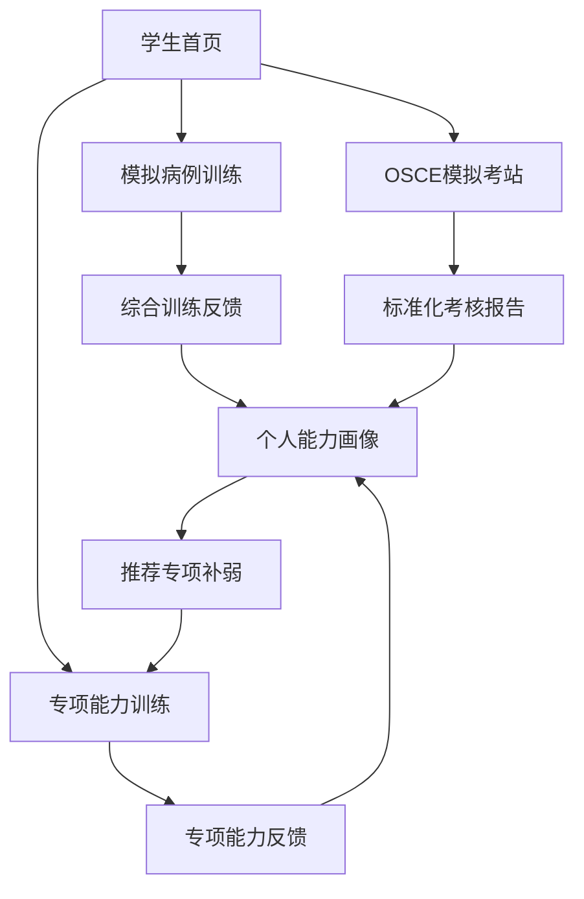

# 珞珈儿科智训——四大方向详细功能大纲

## 一、项目总体定位

### 1. 项目名称

**珞珈儿科智训——儿科智能临床能力训练与 OSCE 考核系统**

### 2. 建设目标

本项目面向医学生儿科临床教学，构建覆盖“问诊—查体—判断—沟通—考核—反馈”的智能训练平台。

系统以标准化儿科病例为核心，通过智能患儿、智能家长、可视化体格检查、器材操作、儿科临床推理和 OSCE 评分，重点解决传统儿科教学中病例资源不足、典型体征难以反复呈现、学生实践机会有限、家长沟通训练缺失以及考核反馈不及时等问题。

### 3. 四大核心方向

1. 模拟病例训练；
2. OSCE 模拟考站；
3. 专项能力训练；
4. 儿科专科资源库。

### 4. 四大方向之间的关系

核心逻辑：

> 儿科专科资源库提供内容，模拟病例训练负责综合学习，专项能力训练负责补弱，OSCE 模拟考站负责标准化评价，最终形成个性化反馈与重新训练闭环。

---

## 二、方向一：模拟病例训练

### 1. 模块定位

模拟病例训练是系统的主要教学入口。

学生以接诊一名虚拟患儿为任务，依次完成问诊、体格检查、辅助检查、诊断决策和家长沟通。该模块强调“边做边学”，允许系统提供提示、纠错和操作引导。

### 2. 解决的教学痛点

- 学生掌握疾病知识，但不会将知识应用于完整病例；
- 儿科问诊对象复杂，既要询问患儿，也要询问家长；
- 学生容易遗漏出生史、喂养史、生长发育史和预防接种史；
- 典型儿科体征难以在临床教学中反复出现；
- 临床见习中学生动手机会有限；
- 学生不会把病史、体征和检查结果整合为诊断依据；
- 传统训练通常缺少家长沟通和健康宣教环节。

### 3. 完整训练流程

### 4. 病例选择

学生可以根据以下条件选择病例：

- 年龄阶段：新生儿、婴儿、幼儿、学龄前期、学龄期、青春期；
- 病种类型：呼吸、消化、感染、神经、血液、免疫等；
- 难度等级：基础、进阶、综合；
- 训练重点：问诊、查体、临床判断、沟通；
- 病例状态：首次训练、待完成、建议重练。

病例页面展示：

- 患儿基本信息；
- 就诊科室；
- 主诉；
- 病例难度；
- 建议训练时长；
- 本病例重点能力；
- 是否包含传染病处置要求。

### 5. 智能问诊

#### 5.1 基本交互

学生通过文字或语音主动输入问题，智能患儿或智能家长根据病例设定回答。

必须明确：

> 学生负责提问，智能患儿或家长只回答学生已经询问的内容，不主动泄露完整病史。

#### 5.2 双角色模拟

系统可根据问题自动判断回答者：

- 患儿能够表达的问题，由患儿回答；
- 出生史、喂养史、接种史等由家长回答；
- 低龄患儿无法准确表达时，由家长代述；
- 患儿与家长的回答可能存在信息差，需要学生进一步核实。

界面应清晰区分：

- 学生；
- 患儿；
- 家长；
- 系统教学提示。

#### 5.3 儿科特色问诊内容

问诊范围包括：

- 主诉；
- 现病史；
- 既往史；
- 出生史；
- 喂养史；
- 生长发育史；
- 预防接种史；
- 过敏史；
- 传染病接触史；
- 家族史；
- 用药史；
- 精神、食欲、睡眠及大小便情况。

#### 5.4 训练模式反馈

系统可以提供：

- 关键问题遗漏提醒；
- 重复问题提示；
- 诱导性提问提示；
- 不适合儿童年龄的表达提示；
- 推荐追问方向；
- 病史采集完整度；
- 问诊结构评价。

提示可以设置为不同等级：

- 无提示；
- 轻度提示；
- 详细教学提示。

### 6. 可视化体格检查

#### 6.1 患儿交互模型

学生可以点击患儿身体部位：

- 头面部；
- 口腔和咽部；
- 颈部；
- 胸部；
- 腹部；
- 四肢；
- 皮肤；
- 神经系统相关部位。

点击后可触发：

- 部位放大；
- 患儿姿势变化；
- 张口、伸舌等动作；
- 皮疹或体征细节展示；
- 检查结果记录。

#### 6.2 检查器材工具栏

包含：

- 听诊器；
- 体温计；
- 血压计；
- 压舌板；
- 手电筒；
- 叩诊锤；
- 软尺；
- 脉搏血氧仪；
- 检查手套；
- 消毒用品。

#### 6.3 器材与部位校验

系统必须校验：

- 器材是否正确；
- 检查部位是否正确；
- 操作顺序是否合理；
- 是否完成必要的准备工作；
- 是否存在患儿安全或感染控制问题。

典型规则示例：

- 未使用压舌板时，只能看到有限的口腔表面信息；
- 听诊器用于胸部后，才能获得呼吸音；
- 血压计袖带型号选择错误时，血压结果可能不准确；
- 未进行手卫生时，系统提示感染控制风险。

#### 6.4 操作反馈

- 正确操作：展示检查结果并记录操作；
- 错误操作：说明器材或部位不匹配；
- 不规范操作：提示正确顺序；
- 患儿不配合：需要先进行安抚沟通；
- 危险操作：立即阻止并说明风险。

### 7. 临床判断

学生根据已获得的信息完成：

- 病情摘要；
- 初步诊断；
- 诊断依据；
- 鉴别诊断；
- 辅助检查选择；
- 危重程度判断；
- 治疗与处置建议；
- 是否需要隔离、上报或转诊。

系统不应直接公布答案，而应判断学生结论是否有病例证据支持。

### 8. 家长沟通

学生需要完成：

- 解释患儿当前情况；
- 说明检查目的；
- 解释诊断依据；
- 说明治疗方案；
- 回答家长疑问；
- 安抚焦虑情绪；
- 开展用药指导；
- 进行健康宣教；
- 说明复诊和危险信号；
- 说明隔离或家庭防护要求。

### 9. 训练结果

训练结束后输出：

- 病史采集完整度；
- 查体规范度；
- 关键体征发现情况；
- 诊断依据充分度；
- 临床处置合理性；
- 沟通表达评价；
- 遗漏步骤；
- 错误操作；
- 推荐重新训练的环节。

---

## 三、方向二：OSCE 模拟考站

### 1. 模块定位

OSCE 模拟考站不是另一套问诊系统，而是统一临床训练场景的“考核模式”。

它与模拟病例训练共用：

- 病例；
- 智能患儿及家长；
- 体征模型；
- 检查器材；
- 临床操作界面；
- 学生行为记录。

区别在于 OSCE 考核过程中关闭教学提示，增加计时、评分、留痕和考核纪律。

### 2. 解决的教学痛点

- 学生缺少正式 OSCE 考试前的模拟机会；
- 教师组织标准化病人考核成本较高；
- 不同教师的评分尺度可能不一致；
- 传统考核只能看到结果，难以完整记录过程；
- 学生考后只知道总分，不清楚具体扣分原因；
- 教师难以对大批量学生进行逐项复盘。

### 3. 考核模式特点

| 项目 | 模拟病例训练 | OSCE 模拟考站 |
| --- | --- | --- |
| 主要目的 | 学习和练习 | 测评和认证 |
| 是否提供提示 | 可以提供 | 原则上不提供 |
| 是否允许重试 | 可以 | 考核中不允许 |
| 是否限时 | 可选 | 必须限时 |
| 错误反馈 | 即时反馈 | 结束后反馈 |
| 评分要求 | 学习完成度 | 标准评分量表 |
| 操作记录 | 学习轨迹 | 完整考核证据 |

### 4. 考站类型

#### 4.1 问诊考站

考核内容：

- 问诊结构；
- 关键病史；
- 儿科特殊病史；
- 信息核实；
- 医学语言；
- 人文关怀。

#### 4.2 体格检查考站

考核内容：

- 检查准备；
- 手卫生；
- 器材选择；
- 检查顺序；
- 操作方法；
- 阳性体征识别；
- 患儿保护。

#### 4.3 临床思维考站

考核内容：

- 病情归纳；
- 初步诊断；
- 诊断依据；
- 鉴别诊断；
- 辅助检查；
- 治疗处置；
- 危重信号识别。

#### 4.4 沟通考站

考核内容：

- 病情解释；
- 家长情绪回应；
- 知情沟通；
- 健康宣教；
- 用药指导；
- 隔离及复诊指导。

#### 4.5 综合考站

在同一个病例中完成：

> 问诊 → 查体 → 判断 → 沟通

综合考站最适合智能体大赛现场展示，因为能够体现完整教学闭环。

### 5. OSCE 考核流程

### 6. 标准化评分维度

建议采用百分制：

- 问诊与信息采集：20 分；
- 体格检查与操作规范：25 分；
- 临床思维与诊断决策：25 分；
- 沟通与人文关怀：15 分；
- 患者安全与感染控制：10 分；
- 时间管理与整体表现：5 分。

具体分值应由儿科教师根据不同病例调整。

### 7. 评分证据

每一个得分或扣分均应尽量提供证据：

- 学生实际提问内容；
- 已完成和遗漏的病史项目；
- 使用的器材；
- 检查部位；
- 操作先后顺序；
- 学生提交的诊断；
- 沟通中的关键表达；
- 操作时间点；
- 对应评分标准。

系统应避免只输出一个无法解释的总分。

### 8. 考核结果

#### 8.1 学生端

- 总分；
- 分项得分；
- 能力雷达图；
- 关键遗漏；
- 错误操作；
- 扣分证据；
- 标准操作参考；
- 推荐专项训练。

#### 8.2 教师端

- 班级成绩分布；
- 高频失分点；
- 各能力维度平均分；
- 学生操作回放；
- 评分复核；
- 成绩导出；
- 病例难度分析。

---

## 四、方向三：专项能力训练

### 1. 模块定位

专项能力训练用于学生的短板补强。

它不要求学生每次完成完整病例，而是把临床能力拆分为若干可反复练习的小任务，适合课前预习、课后巩固和 OSCE 考前训练。

### 2. 解决的教学痛点

- 完整病例训练耗时较长；
- 学生很难快速定位自己的薄弱能力；
- 同一项技能缺少高频重复练习；
- 教师无法对不同学生实施差异化训练；
- 学生考核失分后不知道应该从哪里开始补强。

### 3. 专项一：儿科问诊训练

训练内容：

- 主诉追问；
- 现病史采集；
- 出生史；
- 喂养史；
- 生长发育史；
- 预防接种史；
- 过敏史；
- 传染病接触史；
- 家族史；
- 病史总结。

训练形式：

- 关键问题补全；
- 自由问诊；
- 漏问纠正；
- 问诊顺序训练；
- 不同年龄儿童问诊；
- 患儿与家长信息核实。

### 4. 专项二：儿童体征识别与检查

训练内容：

- 皮疹观察；
- 呼吸状态判断；
- 脱水体征识别；
- 口腔及咽部检查；
- 心肺听诊；
- 腹部检查；
- 神经系统检查；
- 生长发育测量；
- 器材选择；
- 检查顺序。

训练形式：

- 看图识别体征；
- 点击检查部位；
- 器材与部位匹配；
- 检查步骤排序；
- 正常与异常结果对比；
- 错误操作纠正。

### 5. 专项三：儿科传染病临床判断

训练重点：

- 年龄与疾病特点；
- 发热与皮疹演变；
- 皮疹形态和分布；
- 预防接种史；
- 流行病学史；
- 密切接触史；
- 传播途径；
- 隔离措施；
- 报告要求；
- 危重信号；
- 鉴别诊断。

可设计的训练任务：

- 发热伴皮疹鉴别；
- 手足口病风险判断；
- 麻疹与其他出疹性疾病鉴别；
- 猩红热临床特征判断；
- 流感和普通上呼吸道感染鉴别；
- 儿童常见传染病隔离措施选择。

### 6. 专项四：患儿及家长沟通

训练场景：

- 患儿害怕检查；
- 家长焦虑；
- 家长质疑检查；
- 家长要求使用抗生素；
- 家长拒绝住院；
- 家长不配合隔离；
- 家长隐瞒接触史；
- 危重病情告知；
- 居家护理指导；
- 用药和复诊指导。

评价维度：

- 是否回应情绪；
- 表达是否通俗；
- 是否解释原因；
- 是否尊重患儿；
- 是否确认家长理解；
- 是否给出明确行动建议；
- 是否完成风险告知。

### 7. 个性化推荐

专项训练可以通过以下方式触发：

- 学生自主选择；
- 模拟病例训练结束后推荐；
- OSCE 低分项目自动推荐；
- 教师为班级布置；
- 系统根据历史能力画像推荐。

例如：

> 学生在 OSCE 考核中连续遗漏“预防接种史”和“传染病接触史”，系统自动推荐“儿科传染病问诊专项”。

### 8. 训练结果

每次专项训练输出：

- 本次完成度；
- 正确率；
- 平均反应时间；
- 高频错误；
- 与上次相比的进步；
- 是否达到掌握标准；
- 推荐下一项训练。

---

## 五、方向四：儿科专科资源库

### 1. 模块定位

儿科专科资源库是整个平台的内容底座。

它主要服务教师建设病例、维护体征、设置智能角色和制定 OSCE 标准，不需要在学生首页展示为大量独立入口。

### 2. 解决的教学痛点

- 儿科教学资源分散；
- 病例、图片、体征和评分标准缺少统一组织；
- 通用人工智能容易生成不符合儿科规范的回答；
- 病例来源和版本难以追溯；
- 教师难以持续维护和更新教学内容；
- 不同训练模块容易出现答案不一致。

### 3. 病例库

每个病例包含：

- 病例编号；
- 病种名称；
- 患儿年龄和性别；
- 主诉；
- 现病史；
- 既往史；
- 出生史；
- 喂养史；
- 生长发育史；
- 预防接种史；
- 接触史；
- 家族史；
- 体格检查；
- 辅助检查；
- 标准诊断；
- 鉴别诊断；
- 治疗与处置；
- 沟通重点；
- OSCE 评分表；
- 参考依据；
- 审核教师；
- 版本及更新时间。

### 4. 儿童体征资源

体征库包含：

- 体征名称；
- 适用年龄；
- 所属系统；
- 正常表现；
- 异常表现；
- 对应疾病；
- 检查部位；
- 所需器材；
- 正确操作步骤；
- 可视化素材；
- 音频素材；
- 动画素材；
- 错误操作提示；
- 临床意义。

素材形式包括：

- 临床图片；
- 标准化病人图片；
- 呼吸音和心音；
- 皮疹局部图；
- 口腔体征图；
- 检查动作；
- 交互动画。

### 5. 儿科传染病特点资源

内容包括：

- 病原学；
- 好发年龄；
- 流行季节；
- 传播途径；
- 潜伏期；
- 典型表现；
- 皮疹特点；
- 发热规律；
- 接触史；
- 预防接种；
- 鉴别诊断；
- 重症预警；
- 隔离措施；
- 报告要求；
- 家庭健康宣教；
- 参考指南及版本。

该资源同时支撑：

- 问诊回答；
- 体征展示；
- 临床推理；
- 专项训练；
- OSCE 评分。

### 6. 沟通场景资源

每个沟通场景包含：

- 场景类型；
- 患儿年龄；
- 家长身份；
- 家长情绪；
- 家长核心诉求；
- 可能的质疑；
- 不良沟通触发点；
- 推荐沟通策略；
- 必须告知的信息；
- 禁忌表达；
- 评价标准；
- 场景结束条件。

### 7. OSCE 量表资源

包含：

- 考站名称；
- 考核目标；
- 考核时间；
- 标准任务；
- 评分项目；
- 分值；
- 关键步骤；
- 一票否决项；
- 患者安全项；
- 评分证据要求；
- 教师复核规则；
- 适用病例。

### 8. 教师资源管理

教师可以：

- 新建病例；
- 复制已有病例；
- 编辑病例；
- 上传体征素材；
- 配置患儿和家长角色；
- 设置回答边界；
- 配置器材与部位规则；
- 设置训练提示；
- 设置 OSCE 评分表；
- 发布或撤回病例；
- 查看版本记录；
- 审核人工智能生成内容。

### 9. 内容质量管理

所有医学内容应建立：

- 来源标注；
- 指南版本；
- 教师审核；
- 病例脱敏；
- 素材授权；
- 发布审批；
- 修改记录；
- 定期复核；
- 错误反馈；
- 内容下架机制。

人工智能不得自行覆盖教师审核后的标准答案。

---

## 六、学生端整体操作路径

首页建议只保留三个主要入口，避免功能堆叠：

1. 开始模拟病例训练；
2. 进入专项能力训练；
3. 参加 OSCE 模拟考核。

“儿科专科资源库”主要作为教师端和后台能力，不作为学生首页第四个同级入口。

学生个人中心包括：

- 最近训练；
- 待完成任务；
- OSCE 成绩；
- 能力画像；
- 错题和遗漏项；
- 教师评语；
- 推荐训练；
- 学习成长记录。

---

## 七、教师端整体功能

### 1. 教学任务管理

- 创建课程；
- 选择病例；
- 布置训练；
- 设置完成时间；
- 指定班级；
- 设置训练模式；
- 设置提示等级；
- 设置考核标准。

### 2. 班级学习分析

- 完成率；
- 平均成绩；
- 高频漏问项；
- 高频错误操作；
- 薄弱知识点；
- OSCE 分项成绩；
- 班级能力分布；
- 学生进步趋势。

### 3. 学生过程查看

- 问诊记录；
- 操作顺序；
- 器材使用情况；
- 诊断提交内容；
- 沟通记录；
- OSCE 扣分证据；
- 系统反馈；
- 教师追加评语。

### 4. 内容审核

- 病例审核；
- 体征素材审核；
- 标准答案审核；
- 人工智能回答审核；
- OSCE 量表审核；
- 医学依据和版本审核。

---

## 八、四个方向的边界总结

| 方向 | 核心问题 | 学生在做什么 | 系统发挥什么作用 |
| --- | --- | --- | --- |
| 模拟病例训练 | 如何学会完整接诊 | 完成问诊、查体、判断和沟通 | 提示、纠错、引导和反馈 |
| OSCE 模拟考站 | 是否真正掌握 | 在限时条件下独立完成考站 | 留痕、评分并生成证据 |
| 专项能力训练 | 哪一项能力需要补强 | 反复训练单项技能 | 根据短板提供针对性练习 |
| 儿科专科资源库 | 教什么、依据是什么 | 间接使用标准化资源 | 为所有训练和考核提供内容 |

一句话区分：

- 模拟病例训练解决“怎么学”；
- 专项能力训练解决“哪里弱、怎么补”；
- OSCE 模拟考站解决“学得怎么样”；
- 儿科专科资源库解决“用什么内容教、按照什么标准教”。

---

## 九、比赛展示重点

建议比赛现场只演示一例完整病例：

1. 学生主动向患儿或家长问诊；
2. 点击患儿部位并选择正确器材检查；
3. 系统根据操作动态呈现体征；
4. 学生完成诊断与处理；
5. 学生处理家长沟通场景；
6. 系统生成可解释的 OSCE 评分；
7. 根据失分项自动推荐专项训练。

最终可以概括为：

> 本系统以儿科专科资源库为底座，通过模拟病例训练、专项能力训练和 OSCE 模拟考核三种教学应用，形成“学、练、考、评、改”一体化的儿科临床能力培养闭环。
